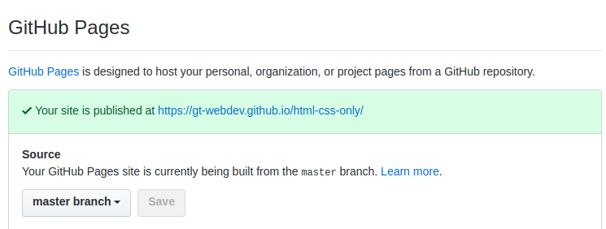
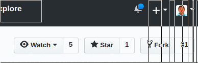

# html-css-only

### An example of a good clean site in pure HTML &amp; CSS
[See the demo!](https://gt-webdev.github.io/html-css-only/#)

You can deploy this in three clicks:
 1. Click fork
 2. Click Settings
 3. Enable Github Pages on the "master" branch
 

Your site should be reachable at `https://<Username>.github.io/html-css-only`


## Adding bodymovin animations to a webpage

We will be adding bodymovin animations to this simple portfolio site

### Setting up

1. Fork the repo on Github
	
2. Clone the repo so you can edit things locally
3. Open up `index.html` in a web browser, you can refresh that page to see changes you made locally


### Pick an animation 

1. go to [lottiefiles.com](lottiefile.com) and pick out an animation
2. download it, and copy the `.json` file into the `assets` folder as `my-animation.json`

### Load in the animation

1. Get the bodymovin library on your webpage.

Edit `index.html`, insert this `<script/>` tag inside the `<head>` tag:

```html
	<script src="https://cdnjs.cloudflare.com/ajax/libs/bodymovin/4.13.0/bodymovin.js"></script>
```

**for example**: 
```html
...
<head>
	<meta charset="UTF-8">
	<meta name="viewport" content="width=device-width, initial-scale=1.0">
	<meta http-equiv="X-UA-Compatible" content="ie=edge">
	<link rel="stylesheet" href="assets/css/main.css" />
	<script src="https://cdnjs.cloudflare.com/ajax/libs/bodymovin/4.13.0/bodymovin.js"></script>
	<title>My site</title>
</head>
...

```

This `script` automatically runs when the page loads. It fetches the `bodymovin` library from a CDN, and sets the global propery `bodymovin`.

Now if you open up the devtool in chrome, for example, you should see `bodymovin` as a variable:


2. Now we can create an empty `<div/>` element, for our animation, and give it an `id="to-animate"`:

```html
<div id="to-animate"/>
```

**for example, you can place it right on the front page!**:
```html
<header id="header" class="alt">
  <div class="inner">
    <div id="to-animate"/>
    <h1>Hello World</h1>
    <p>There's nothing here yet...</p>
  </div>
</header>
```


3. Now add a `<script>` tag just before the closing `</body>` tag. 

We will initialize our animation here:

```html
...
<script>

  // your code goes here

</script>
</body>
```


4. Now we initialize the animation:

```html
...
<script>

  // your code goes here

  let animation = bodymovin.loadAnimation({
    container: document.getElementById('to-animate'),
    renderer: 'svg',
    loop: true,
    autoplay: true,
    path: 'assets/my-animation.json'
  })

</script>
</body>
```

Here, we tell `bodymovin` to render as 'svg', to loop infinitely, and to autoplay when the page loads.

5. Style your animation

You can use `CSS` to size and position your animation. Here I've inserted a `<style>` tag, right after the opening `<body>` tag:

```css
<style>

  #to-animate {
    max-width: 10em;
    display: inline-block;
  }

</style>
```

6. Go forth and try out some more stuff

[bodymovin Documentation](https://github.com/airbnb/lottie-web#usage)


[View demos (with source code) on Copepin](https://codepen.io/collection/nVYWZR/)
